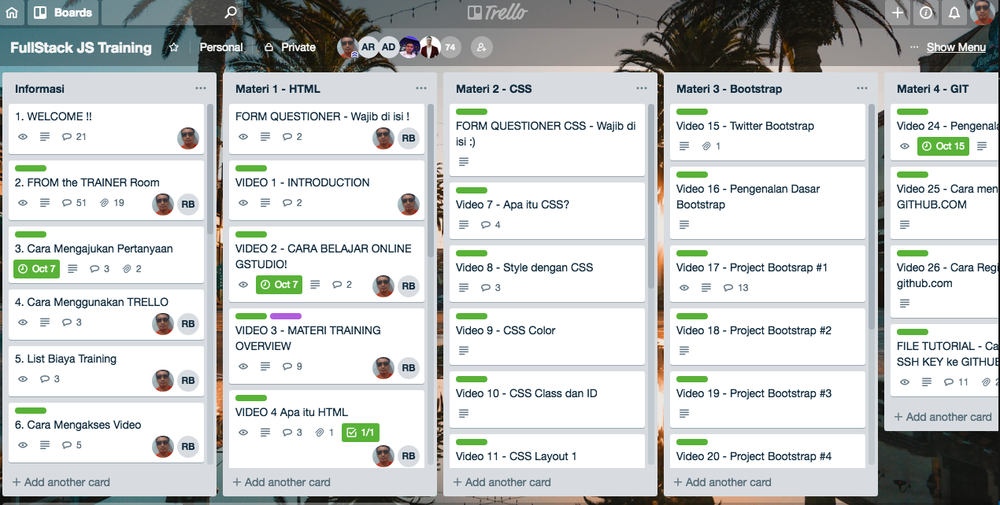

# Welcome to Bootcamp Preparation 

Pelatihan Fullstack JavaScript Developer dikelola oleh MedioCademy.com

#### Thema

> ##### "Cara Cerdas & Cepat Menjadi Fullstack JavaScript Developer Profesional".

#### Nama Bootcamp

3 Days Bootcamp **"plus"** 3 Months Fullstack JavaScript Developer.

#### Penjelasan

Pelatihan ini adalah Kombinasi antara **"3 Hari Kelas Tatap Muka"** plus **"3 Bulan Kelas ONLINE"** di web mediocademy.com.

#### Persyaratan mengikuti kelas ini

##### 1. Keahlian Dasar.

Tidak ada keahlian khusus programming, kelas ini untuk umum dan semua level.

##### 2. Computer Hardware.

* Memiliki Laptop minimal Dual Core.
* RAM minimal 4 Gb.
* Koneksi Internet.

##### 3. Computer Operating System.

* Operating System OS, Linux, Windows 10.

## Langkah2 sesudah mendaftar

Ini adalah langkah-langkah sesudah mendaftar :

#### 1. Membuat akun trello.com.

Aplikasi trello.com kita gunakan sebagi tempat diskusi dan list materi, silahkan buka browser anda dan ketikkan trello.com kemudian lakukan sign-up.

#### 2. Login trello dengan username dan password anda.

Setelah login trello anda akan melihat kolom dan list board di trello, lihat gambar.

 

#### 3. Membuat akun gitlab.com

Gitlab.com kita gunakan sebagai repository (online) tempat kita menyimpan MATERI dan SOUCE CODE.
Buka browser anda dan ketikan gitlab.com, silahkan signup gunakan email yang sudah terdaftar pada kami.

#### 4. Login di gitlab.com

Setelah membuat akun di gitlab.com silahkan login di gitlab.com
