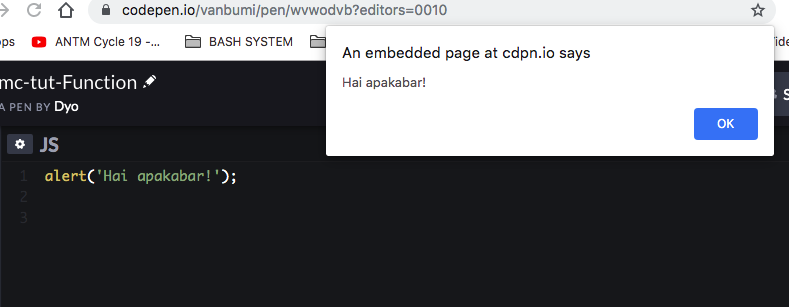
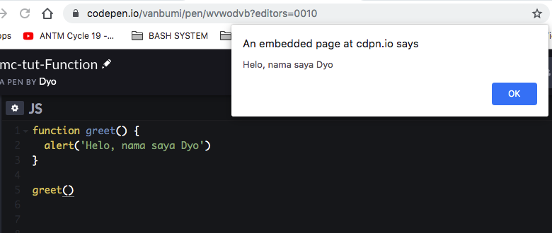
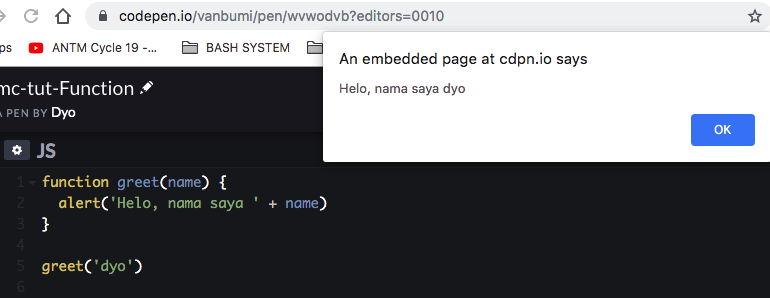
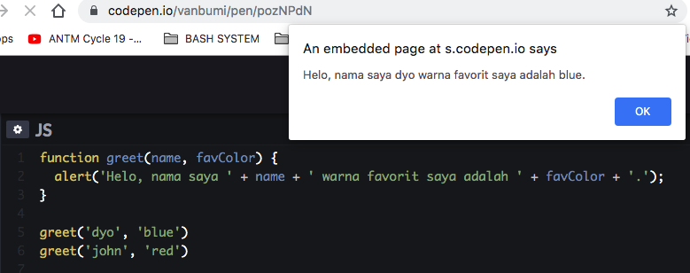
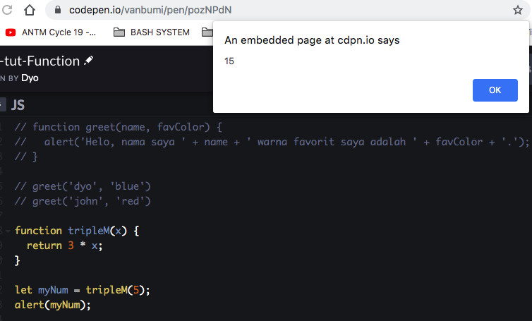

# Function


### Apa itu function? 

Function adalah Action, berfungsi agar browser melakukan aksi.


### Code environment 

codepen.io

Buka codepen.io, dan tuliskan pada kolom JS.

```javascript
alert('Helo JS gank');
```


pada function bs di sertakan argument didalam kurung.

### Membuat function baru 

Di luar function yang ada di browser:

```javascript
function greet() {
  alert('Halo nama saya Dyo')
}
```


### Membuat parameter pada function:

```javascript
function greet(name) {
  alert('Halo nama saya ' + name)
}

// memanggil dan menyertakan data
greet('dyo')
```


### Dalam gambar

// memanggil dan menyertakan data
greet('dyo')




Gambar #1.




Gambar #2




Gambar #3




Gambar #4




Gambar #5


