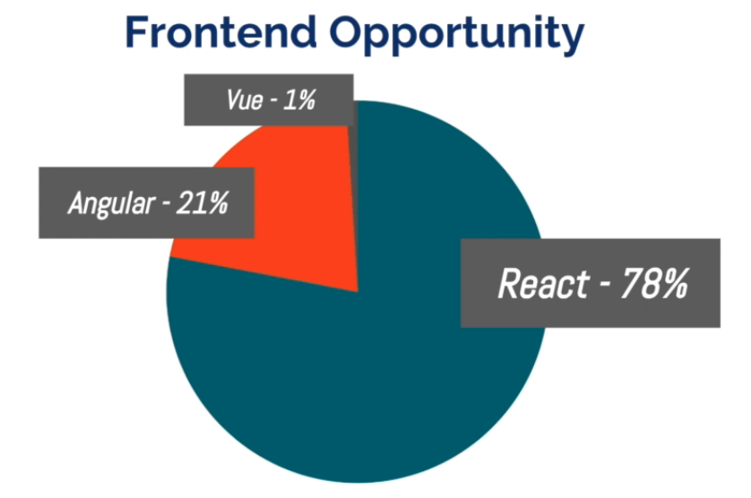
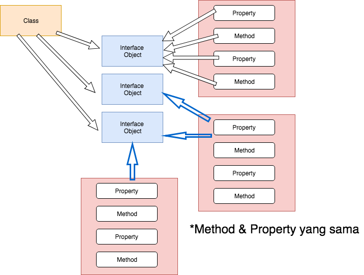

## Materi Pelatihan React Fundamental.

# ReactJS.

* Official Link React : https://reactjs.org/
* Done version: <https://portfoliofundamental.herokuapp.com/>. 
* Local path Materi: Desktop > 01-KelasFulstack > Materi > materi-intro-react.md.
* Local path ProjectCase1: Desktop > 01-KelasFulstack > project-react > portfolio.
* Local path ProjectCase2: Desktop > 01-KelasFulstack > project-react > ....


## Apa yang anda dapat pada Pelatihan ini.

**Satu**

> Pelatihan ini memiliki satu tujuan menyeluruh: yaitu memberikan Anda **pengetahuan dasar** untuk menjadi **React Developer**.

**Dua**

> Setelah pelatihan ini anda akan tahu cara kerja React sebagai framework dan engine.

**Tiga**

> Bagaimana kerja React dibelakang layar, bagaimana React cocok dengan rancana besar sebuah web development. 

## Kenapa harus menjadi React Developer.

> Jika anda ingin mnejadi fullstack web developer anda harus belajar "front-end", ada beberapa front-end JS dan kenapa React? Alasannya adalah **Opportunity dan Good Engineering**.



> Kelebihan React lainnya adalah "Kombinasi Power, Elegance dan Simplicity" sebagai turunan dari JavaScript.

> Learning curve belajar React lebih singkat dari framework JS lain.


<br>

## Pengenalan React.

JavaScript membuat web aplikasi menjadi dinamis, merubah tampilan dan struktur tampilan, respond user event seperti mengetik, klik, hover pada aplikasi. Tanpa JavaScript website akan banyak melakukan loading saat link di klik dengan mengambil halaman html baru, ini adalah static flow, dengan JavaScript halaman web menjadi hidup dan dinamis tanpa harus me-loading halaman baru.

React berhubungan dengan semua diatas sebagai framework JavaScript, React mengoptimalkan JavaScript dengan menggunakan web browser dan membuat web app dinamis.


## Instalasi

### Instalasi Software

**1. Code Editor**: Visual Studio Code (rekomendasi) https://code.visualstudio.com/.

Cara setup agar code editor bisa dibuka di browser:
	
* cmd-shift-p (MacOS & Linux).
* ctrl-shift-p (Windows).
* Pilih dan Enter “Shell Command”, and choose “Install ‘code’ command in path.
* Buka folder project dan ketik ```code .``` maka anda dapat membuka Visual Studio Code berikut folder project dan file2 nya.
	
	Instal Extention: **ES7 React/Redux/GraphQL/React-Native snippets** (cukup search React).
	

**2. Commandline App**: 
		
	* Terminal (MacOS & Linux user). 
	* GitBash (Windows user), cara instal GitBash: https://stackoverflow.com/questions/42606837/how-do-i-use-bash-on-windows-from-the-visual-studio-code-integrated-terminal

**3. Node.js** download link: https://nodejs.org/en/download/

Setelah node terinstal sempurna kemudian cek version dengan cara sbb:
		
	node -v
	# harus `v8.8.1` or higher.
	
	npm -v
	# harus `v5.4.2` or higher.

<br>

## Membuat aplikasi Portfolio

Yang akan di pelajari pada aplikasi ini adalah konsep React:

1. React Element.
2. React Component.
3. React State.
4. React Props.


### create-react-app tool

Link: https://github.com/facebook/create-react-app

Pada Terminal buatlah folder project baru anda:

	mkdir project-react
	
	cd project-react

Menggunakan npx:

	npx --help

Membuat aplikasi React:

	npx create-react-app portfolio

setelah instalasi selesai:

	cd portfolio

buka code editor dengan perintah code spasi titik.

	code .

anda bisa lihat file struktur di React app sbb:

	portfolio
		-> node_modules
		-> public
			-> favicon.ico
			-> index.html
			-> manifest.sjon
		-> src
		-> .gitignore
		-> package.json
		-> README.md
		-> yarn.lock


kembali ke Terminal dan ketikan perintah sbb:

	npm start
	
	atau
	
	yarn start

dan jendela browser localhost:3000 dan aplikasi React akan terbuka.

Buka folder public > index.html, akan terlihat struktur kode halaman React tsb.

anda akan lihat tidak ada konten di dalam file index.html ini, karena konten di render dari halaman lain yang di tempatkan pada div root --> ```<div id="root"></div>```.

Konten di insert dari halaman **index.js**, dimana terdapat function **ReactDOM** yang akan merender **react code** dan menyisipkan ke dalam html:

	ReactDOM.render(<App />, document.getElementById('root'));

- dari function diatas yang menjadi target element adalah **root** sebagai id selector.	
- function diatas adalah **JSX** (JavaScript Extention) yang digunakan untuk menyisipkan element atau kode html.
- dari function diatas di render <App /> dimana element App di import dari halaman App.js:

		import App from './App';
		

Selain App di import juga:

	import React from 'react';
	import ReactDOM from 'react-dom';
	import './index.css';
	import * as serviceWorker from './serviceWorker';		

<br>	
	
**Next!** buka folder src > App.js, dan tambahkan kode sbb diatas `````` :

	<p>Hello Dyo!</p>

kemudian simpan, maka browser akan update otomatis.

App.js berisi component react yang di tulis dengan format JSX, konten file App.js inilah yang akan disisipkan kedalam html.

Masih di halaman App.js hapus semua konten didalam element ```<div className="App">``` dan ketikan "Hello React!", simpan dan akan update otomatis di browser.


<br>

## ReactDOM, Element dan JSX

Anda buka file struktur portfolio app dengan code editor, kita akan delete **src** folder, dengan tujuan agar kita bisa membuat ulang kode react dari awal sehingga memudahkan pemahaman anda dalam belajar React.

Hapus folder **src** dan buat baru folder **src**.

Buat file baru **index.js**

Import react library ke dalam file index.js:

	import React from 'react';

Import react DOM library:

	import ReactDOM from 'react-dom';

Render element html dengan ReactDOM:

	ReactDOM.render(<div>Coba React</div>, document.getElementById('root'));

Keterangan:

Kita menggunakan ```ReactDOM.render()``` untuk merender JSX kedalam html dan menampilkannya:  ```<div>Coba React</div>``` pada argument pertama, pada argument kedua kita spesifikasi lokasi menempatkannya.
Dengan mengakses document object javascript untuk menangkap element  html dengan **id = root**, dan menyisipkan file render di sana, cek di file index.html.

Kode lengkap sbb:

		import React from 'react';
		import ReactDOM from 'react-dom';
		
		ReactDOM.render(<div>Coba React</div>, document.getElementById('root'));


​		
​		

Cek di browser update akan otomatis tampil "Coba React".

<br>

## React Component

Component adalah potongan-potongan kode / class yang dibentuk menjadi satu menjadi sebuah aplikasi React.

Untuk membuat React component kita akan membuat file baru App.js :


	import React, { Component } from 'react';


Pada file App.js ini kita harus import React Library, selanjutnya kita harus import Component class, dengan menuliskanya antara { } sebagai opsional import.

Selanjutnya membuat **react component** yang ditulis sebagai javascript class, akan ditulis lengkap sbb:

	import React, { Component } from 'react';
	
	class App extends Component {
		render() {
			return (
				<div>
					<h1>John Due</h1>
					<p>I am Software Engineer.</p>
					<p>Looking forward to work on your meaningful projects.</p>
				</div>
			)
		} 
	}
	
	export default App;

Keterangan:

```class App extends Component {}```: Component pada React adalah sebuah "class" yang "extends" dari main class yaitu "Component" class.

```render()```: setiap class dapat merender sebuah ```return()```.

```return()```: class merender return yang didalamnya adalah kode JSX.
	
<br>	
	
**Kembali ke file index.js**:

Import file App.js ke dalam file index.js:

	import App from './App';

Update react dom sbb:

	ReactDOM.render(<App />, documen.getElementById('root'));


Kode lengkapnya sbb:

	import React from 'react';
	import ReactDOM from 'react-dom';
	import App from './App';
	
	ReactDOM.render(<App />, document.getElementById('root'));


Simpan dan cek di browser:

	John Due
	I am Software Engineer
	
	I am Looking forward to work in your meaningful projects.

Bila kita klik kanan > inspect > body > div id = root:	
	
	<div id="root">
		<div>
			<h1>John Due</h1>
			<p>I am Software Engineer</p>
			<p>I am Looking forward to work in your meaningful projects.</p>
		</div>
	</div>

<br>

## JavaScript Class

Mempelajari apa itu Class akan memudahkan anda untuk memahami bagaimana React Component di implementasikan dibelakang layar dengan menggunakan pola "*inheritance* dan *class*".

Di dalam JavaScript dengan Class kita dapat membuat sebuah interface untuk object baru.

Interface adalah kumpulan dari properti dan method.

Setiap object baru berbasis class tadi akan memiliki method-method and properti-properti yang sama.



<br>

Contoh: 

Class: Animal

Property: 
* Name
* Age

Method:
* Speak()
* Move()

Secara keseluruhan interface untuk animal class saat ini adalah "name" dan "age" properties serta speak dan move method.

Class dapat di turunkan/diwariskan/inheritance, melalui inheritance kita dapat membuat class baru berdasarkan pada class atas nya (parent).

Contoh:

Class: Animal 
new Class: Lion Class
Kata lain: Lion Class **Extends** dari Animal Class.

Meskipun Lion extends Animal, bisa memiliki property sendiri:

Property: 
* Color
* Speed

Method:
* Roar (auman)

Tapi karena Lion adalah inheriting dari animal class maka juga akan mendapat akses properti dan method yang sama seperti yang sudah di declare oleh animal class.

Jadi Lion juga memiliki nama dan age properti dan speak dan move method. 

Contoh lain Class Animal.
new Class: Bear Class
Bear Class **Extends** Animal Class.

Property:
* Weight.
* Strength.

Method:
* Growl (mengeram).

Karena Bear adalah inheriting dari animal class maka juga memiliki property nama dan age serta method speak dan move. 

Kumpulan dari property dan method disebut interface, artinya masing-masing Class adalah sebuah object, object itu sendiri berdasar class-class ini adalah ini adalah **instances** dari class.

Setiap **instance** memiliki keunikan "nilai" sendiri dan bisa jadi akan men-generate banyak instance dari class yang sama.

Contohnya:

Akan ada 4 macam object berbasis Lion, 3 macam generic Animal dan 4 macam jenis Bear. 

Contoh instance Lion class:

Sebuah Lion class memiliki property unik:

* Color: Golden.
* Speed: 10 km/hour.

Instance Lion yang lain:

* Color: Red.
* Speed: 7 km/hour.

Keduanya adalah instance dari Lion Class, tapi memiliki ke unikan masing-masing.

**Rangkuman**

> Ilustrasi diatas adalah tentang cara kerja class dan inheritance didalam JavaScript.

> Component-component react dibuat dengan melalui inheritance dari **Component** class.

> Sangat penting untuk memahami konsep-konsep ini untuk memahami bagaimana component React bekerja.

Selanjutnya kita akan mempelajari konsep-konsep diatas dalam bentuk code untuk memahami lebih jauh dalam lagi.

<br>

## Latihan

Kembali ke portfolio project.

Buka file index.js, untuk memahami bagaimana class bekerja, buat sebuah class Animal sbb:

	class Animal {
		constructor(name,age) {
			this.name = name;
			this.age = age;
		}
		
		class Speak {
			console.log("I am animal1", this.name, "and I am", this.age, "years old." );
		}
	}
	
	// crate instant
	const animal1 = new Animal('Sarimin', 2);
	
	// call speak method
	animal1.speak();

Cobalah di terminal jalankan ```npm start```.
	
Pada browser klik kanan > inspection > buka tab Console dan refresh browser untuk melihat hasil console.log:

	I am animal1 Sarimin and I am 2 years old.

Kemudian kita akan melihat aktual instance dari Animal1 dengan console.log:

	console.log(animal1);

lihat hasilnya pada tab Console.

**Penjelasan kode**

**Constructor method**, "```constructor()```", kita gunakan agar instance pada class ini dapat mengakses property class parent nya yaitu "name" dan "age".

**Method speak**, "```class Speak()```", kita gunakan untuk menentukan behaviour dari sebuah class, kemudian kita console.log untuk melihat hasil keluarannya pada console.

**New instance monkey**, "```new Animal();```", kita gunakan untuk membuat instance baru dari Animal class.

**Call speak method**, "```animal1.speak();```", kita gunakan untuk memanggil method speak agar bisa di eksekusi.

**Melihat aktual instance yang baru dibuat**, "```console.log(animal1);```", kita gunakan untuk melihat actual Animal class instance yang dibuat.

<br>

## Konsep Inheritance

Kita akan membuat class baru extends dari class Animal:

	class Lion extends Animal {
		constructor(name, age, color, speed) {
			// call property Animal
			super(name,age);
			this.color = color;
			this.speed = speed;
		}
		
		// create method
		roar() {
			console.log("Rooarr I have", this.color, "I can run", this.speed, km per hour)
		}
	}
	
	// Create instance of Lion
	const lion1 = new Lion('Toto', 10, 'golden', 20);
	
	// call as parent class
	lion1.speak();
	
	// call as inheritance class
	lion1.roar();
	
	// to see actual new instance
	console.log(lion1);

Simpan dan lihat hasilnya pada tab console.

<br>

Contoh diatas menjelaskan bagaimana class dan inheritance sistem bekerja pada JavaScript dan menambah pemahaman kita tentang React Component Inheritance Model.
	
Bila anda perhatikan pada file App.js bahwa app Component adalah extends dari Component Class, kerana itu menjadikan app component inherit property-property dan method-method yang sudah di define pada Component Class dari React.


Sebagai pembuktian hal diatas kita akan men-deklarasi dua buah class baru, yaitu satu adalah regular class javascript yang tidak extend ke class component, dan satu lagi class yang extends ke class component: 

Pada file App.js:

	class ReqularClass {}
	class ComponentClass extends Component {}
	
	// membuat instance class masing2
	const reqularClassInstance = new RegularClass();
	const componentClassInstance = new ComponentClass();
	
	// tampilkan 
	console.log('reqularClassInstance', reqularClassInstance);
	console.log('componentClassInstance', componentClassInstance);

Cek hasilnya pada tab console.

<br>

## State

State adalah updatable struktur yang memuat data untuk sebuah component. 

Contoh penggunaan state, untuk mengetahui berapa kali user klik, dengan menggunakan clickedCount() method yang akan menghitung user klik.

Kita akan membuat contoh penggunaan state untuk tombol toggle dimana bila di klik akan muncul detail bio dari aplikasi portfolio yang kita buat.

Kita gunakan kembali file App.js dengan sebelumnya comment out/hapus latihan sebelumnya pada file App.js dan index.js:

Tambahkan div pada paragraph terakhir:

	<div>
		<p>I live in Bekasi, and doing code everyday</p>
		<p>Ngoding is my hobby, I love JavaScript language, and my favorite is React, React is awasome</p>
		<p>If I am not ngoding I will sleep or watch the TV.</p>
	</div>

Simpan dan kemudian cek pada browser 3000.
	
Tambahan informasi bio ini akan kita buat toggleable di klik muncul dan sebaliknya, dimana defaultnya adalah "hidden", untuk fungsionalitas ini kita akan menggunaka **State**.

Kita akan update App component dengan menambahkan state.

Pertama-tama kita tambahkan sebuah constructor pada **app component** terlebih dahulu:

	class App extends Component {
		constructor() {
			this.state = {};
		}
	
		...

sampai disini bila anda simpan dan cek pada browser maka akan ada error "*TypeError: Cannot set property 'state' of undefined*".

Solusi nya kita harus menambahkan **super property** pada constructor untuk memanggil parent class constructor method dari component induknya, atau invoke constructor of the parent component class:

	class App extends Component {
		constructor() {
			super();
			this.state = {};
		}
	
		...

maka error akan hilang.

Update kode diatas sbb:

	class App extends Component {
		constructor() {
			super();
			this.state = { displayBio: false };
		}
	
		...

kemudian pada render method kita update kode nya sbb:

	ender() {
	return (
	  <div>
	    
	    <h1>John Doe</h1>
	    <p>I am Software Engineer</p>
	    <p>I am Looking forward to work in your meaningful projects.</p>
	    {
	      this.state.displayBio ? (
	        <div>
	          <p>I live in Bekasi, and doing code everyday</p>
	          <p>Ngoding is my hobby, I love JavaScript language, and my favorite is React, React is awasome</p>
	          <p>If I am not ngoding I will sleep or watch the TV.</p>
	          <button onClick={this.toggleDisplayBio}>Show less</button>
	        </div>
	      ) : null
				...

**Keterangan**

Kita menggunakan one line if statement:

	this.state.displayBio ? true : otherwise false

Statement sesudah "?" menandakan jika kondisi nya benar.
Statement sesudah ":" jika kondisini nya tidak benar maka ini yang di eksekusi.

Selanjutnya kita akan memberikan **user** untuk memiliki control untuk switch displayBio show atau hidden dalam state dengan menggunakan **setState**.

<br>

## setState.

Materi sebelumnya kita telah mendambahkan **state** pada **app component** untuk mengontrol apakah **displayBio** akan ditampilkan atau tidak. Secara default **displayBio** telah di set **false** (hidden).

Kita akan tambahkan fungsional dinamis didalam state, sehingga user bisa switch antara true dan false.

Pada kode diatas **null** akan kita ubah menjadi **button**, sbb:

	) : (
		<div>
			<button>Read more</button>
		</div>
	)

Cek di browser, lihat hasil nya.

Pada saat kita klik button ini, maka function akan di trigger untuk set boolian menjadi true.

Tambahkan new helper method **readMore** dibawah method **constructor**:

	readMore() {
		// contoh bad practice dengan merubah langsung component state:
		this.state.displayBio = true;
	}

Cara yang benar adalah (**Best practice**) : kita menambahkan component **setState** pada helper method untuk meng-update value **state**.

**setState** method digunakan dengan cara memanggil ```this.setState({ })``` dimana inputnya adalah sebuah object **({...})**.

Kode diatas kita rubah menjadi:

	readMore() {
		this.setState({ displayBio: true });
	}

jadi kita ingin saat button "read more" diklik maka displayBio akan berubah menjadi true.

Kita akan gunakan **onClick** property pada element button:

	<div>
		<button onClick={this.readMore}>Read more</button>
	</div>

Simpan, cek pada browser 3000, klik button **read more**, akan muncul error:

<span style="color: red; font-weight: bold">TypeError: Cannot read property 'setState' of undefined. <br><br> > 10 | this.setState({ display: true })</span>
	
Error ini disebabkan **setState** undefined dan tidak bisa berjalan pada JavaSript karena bukan global method dari JavaScript.

Kita akan melakukan test dengan melakukan console.log terhadap **this** object pada helper method **readMore** sbb:

	readMore() {
		console.log('readMore this', this);
		//this.setState({ displayBio: true });
	}

dan juga kita akan test **this** object pada **constructor** sebagai perbandingan:

	constructor() {
		...
		...
		
		console.log('Component this', this);
	}

Simpan dan lihat pada console tab:

Pada **Component this** adalah **app** dan memiliki akses ke **setState** function, sedangkan bila kita klik Read more button **readMore this undefined**, karena tidak memiliki akses ke **class app component**.

## .bind() method.

Solusi nya JavaScript memiliki special **.bind** method, yang akan pass **this** object, dari satu object ke yang lainnya. Dengan cara this.helperMethod di bind(this) atau dengan bahasa kode nya sbb:

	this.readMore.bind(this);

jd dengan script diatas this dari component class akan dibawa (pass) ke dalam helper method yang kita buat. Lanjut kita set sbb:

	this.readMore = this.readMore.bind(this);

Dengan demikian this pada setState tidak lagi undefined:

	readMore() {
		this.setState({ ... })
	}

Oke ?

Anda lihat juga paragraph bio muncul.

Kita juga akan menambahkan button untuk mengembalikan ke kondisi collapse **hidden**

Pada akhir paragraph tambahkan button **Show less**.

	<button>Show less</button>


​	
Kita akan membuat helper method baru **toggleDisplayBio()**

	toggleDisplayBio() {
		this.setState({ displayBio: !this.state.displayBio })
	}

> ***)** **!** Operator kita gunakan untuk menyatakan kondisi sebaliknya, true to false or false to true.

readMore method bisa kita hapus, jangan lupa untuk bind toggleDisplayBio() method:

	this.toggleDisplayBio = this.toggleDisplayBio.bind(this);

Kemudian tambahkan onClick pada button **Show less** dan **Show more** :

	<button onClick={this.toggleDisplayBio}>Show less</button>
	
	<button onClick={this.toggleDisplayBio}>Show more</button>


​	
Simpan dan cek klik Show more dan Show less.

<br>

## Class Properties dan Initializer.

**class properties dan Initializer syntax** adalah best practice pada React kode untuk setup **state** dan **method** menggunakan syntax ini didalam component.

Saat nya untuk explore *cleaner way*, dengan menggunakan **class property dan initializer syntax**, utamanya adalah kita dapat melampirkan **properti** dan **method** ke object class tanpa harus menggunakan **constructor**.

Jadi refactor kode diatas pada file App.js, kode lengkapnya sbb:

	import React, { Component } from 'react';
	import Projects from './Projects';
	import SocialProfile from './SocialProfiles';
	import profile from './assets/profile.png';
	
	class App extends Component {
	
		state = { displayBio: false }
	
		// helper method dirubah menjadi function arrow.
		toggleDisplayBio = () => {
			this.setState({ displayBio: !this.state.displayBio });
		}
	
		render() {
			return (
				<div>
					
					<h1>John Doe</h1>
					<p>I am Software Engineer</p>
					<p>I am Looking forward to work in your meaningful projects.</p>
					{
						this.state.displayBio ? (
							<div>
								<p>I live in Bekasi, and doing code everyday</p>
								<p>Ngoding is my hobby, I love JavaScript language, and my favorite is React, React is awasome</p>
								<p>If I am not ngoding I will sleep or watch the TV.</p>
								<button onClick={this.toggleDisplayBio}>Show less</button>
							</div>
						) : (
								<div>
									<button onClick={this.toggleDisplayBio}>Read more</button>
								</div>
							)
					}
					<hr />
					<Projects />
					<hr />
					<SocialProfile />
				</div>
			)
		}
	}
	
	export default App;

Pastikan aplikasi masih berjalan di browser 3000.

<br>

## Component project

Kita akan membuat component berikutnya pada portfolio aplikasi, component ini kita sebut project sebagai showcase list dari project yang telah anda kerjakan. 

Project component terdiri dari:

* Image.
* Title.
* Description.
* Social media link.

Untuk image silahkan anda gunakan 3 image anda pribadi sebagai portfolio bisa apa saja bebas, berinama image tsb dengan **project1**, **project2**, **project3**. Buatlah folder **assets** dibawah folder **src**, tempatkan 3 image tsb di folder assets.

Buat folder baru **data** dibawah folder **src**, pada folder **data** kita tempatkan **js file** yang akan gunakan untuk menyimpan data project seperti image, title dan description. Jadi buatlah file baru dibawah data simpan dengan nama **projects.js**

Update file project.js sbb:

**IMPORT**

	import project1 from '../assets/project1.png';
	import project2 from '../assets/project2.png';
	import project3 from '../assets/project3.png';

**Keterangan:**

Tiga baris pertama diatas kita import gambar dari folder assets dan berinama (variable) project1, project2, project3.

**MEMBUAT PROJECT ARRAY**

Selanjutnya membuat data project dengan array, isi data array sesuai dengan project portfolio anda masing-masing dan bebas.

	const PROJECTS = [
		{
			id: 1,
			title: 'Example React Application',
			description: 'A React App that I built, involving JS and core web dev concepts!',
			link: 'https://github.com/vanbumi/example',
			image: project1
		},
		{
			id: 2,
			title: 'My API',
			description: 'A REST API that I built from scratch with GET and POST requests!',
			link: 'https://github.com/vanbumi/example',
			image: project2
		},
		{
			id: 3,
			title: 'Operating Systems Final Project',
			description: 'My unique final project for my university Operating Systems course.',
			link: 'https://github.com/vanbumi/example',
			image: project3
		}
	];

**Keterangan:**	

* Menggunakan SCREAM_CASE sebagai convention untuk global value pada JavaScript project dimana menggunakan huruf BESAR semua.
* Project array adalah collection dari object-object dari masing2 project.

**EXPORT DEFAULT**

	export default PROJECTS;

**Keterangan**

Agar bisa available / di share pada file/ component lain.

<br>

Sekarang buat file **Projects.js** dibawah folder **src**, pastikan **P** dengan HURUF BESAR.

Update Project.js sbb:

	import React, { Component } from 'react';
	import PROJECTS from './data/projects';
	
	class Project extends Component {
		render() {
			return (
				<div>
					<h2>Highlighted Projects</h2>
					<div>
						{
							PROJECTS.map((PROJECT => {
								return (
									<div>{PROJECT.title}</div>
								)
							});
						}
					</div>
				</div>
			)
		}
	}
	
	export default Projects;

Import Projects.js ini pada file App.js:

Pada file App.js:

	import Projects from './Projects';

Tempatkan projects component di akhir render method, dibawah akhir kurung kurawal tambahkan:

	<hr />
	<Projects />

Test di browser 3000 lihat hasilnya.

Klik kanan > inspection > <span style="color:red;">Warning: Each child in an array or interator should have a unique "key" prop.</span>

Update kode nya pada Project.js menjadi sbb:

	<div key={PROJECT.id}>{PROJECT.title}</div>

Simpan dan cek lagi warning akan hilang.

<br>

## Props dan Project Component

Kode pada Project.js diatas kita akan membuat component baru yang akan kita sebut **project component** yang akan kita gunakan untuk men-display list data project, disini kita akan menggunakan **component prop**, **prop** adalah cara parent component untuk melewatkan/menurunkan data kepada child component dibawahnya.

Kita akan membuat component class baru diatas component parent nya:

	class Project extends Component {
		render() {
			return(
				<div>{this.props.project.title}</div>
			)
		}
	};

**Keterangan**

* Kode diatas adalah child component baru yang kita buat, child component ini akan kita gunakan untuk me-list data project yang ada, dengan menggunakan **prop** ```{this.props.project.title}``` sehingga data dari hasil **.map** di parent component bisa dilewatkan kesini.

* **this**: Component children masih dapat mengakses **this**	dan juga **props** untuk melewatkan data dari parent ke children, contoh ```this.props``` beda nya dengan ```this.state```, **state** berlaku internal component, tidak antar component.

* **props**: Digunakan component parent untuk melewatkan datanya ke component children.

* **project**: Adalah nama atribut dari component parents hasil dari method **.map** (loop).

* **title**: Adalah nama key dari object title, seperti description, image dsb.


Kita akan membuat ```console.log('this.props', this.props)``` untuk membuktikan **isi** dari this.props. Letakkan di bawah render():

	render() {
		console.log('this.props', this.props);
	}

Kemudian rubah **tag div** pada parent component menjadi **tag component** ```<Project />``` sbb:

	return (
		<Project key={PROJECT.id} project={PROJECT} />
	)	

simpan, restart browser dan cek di console tab.

Anda lihat this.props > object di log tiga kali untuk masing-masing project yang berisi informasi tentang project itu sendiri.

Sekarang kita akan merender image, description dan link, kita menggunakan **local constants** untuk masing-masing value didalam render method dengan menggunakan **destructuring syntax** sbb:

	const { title, image, description, link } = this.props.project;

kode diatas sama dengan jika kita menulis kode seperti ini:

	const title = this.props.project.title;
	const image = this.props.project.image;
	const description = this.props.project.description;
	const link = this.props.project.link;

jadi kita membuatnya lebih singkat dan clean.

Kemudian kita tampilkan dibawah return dari child component sbb:

	return (
	  <div>
	    <h3>{title}</h3>
	    
	    <p>{description}</p>
	    <a href={link}>{link}</a>
	  </div>
	)

Cek pada browser 3000, kemudian kita beri style sbb:

	return (
		<div style={{ display: 'inline-block', width: 300, margin: 10 }}>
			<h3>{title}</h3>
			
			<p>{description}</p>
			<a href={link}>{link}</a>
		</div>
	)

Kemudian cek lagi pada browser 3000.

<br>

## Social Media Icon


Buatlah file baru socialProfile.js dibawah folder data, kemudian update file sbb:

	import emailIcon from '../assets/email_icon.png';
	import githubIcon from '../assets/github_icon.png';
	import linkedinIcon from '../assets/linkedin_icon.png';
	import twitterIcon from '../assets/twitter_icon.png';
	
	const SOCIAL_PROFILES = [
		{
			id: 1,
			link: 'mailto:dkcodehelper@gmail.com',
			image: emailIcon
		},
		{
			id: 2,
			link: 'https://github.com/15Dkatz',
			image: githubIcon
		},
		{
			id: 3,
			link: 'https://www.linkedin.com/in/david-katz-sf',
			image: linkedinIcon
		},
		{
			id: 4,
			link: 'https://twitter.com/dkcodehelper',
			image: twitterIcon
		}
	];
	
	export default SOCIAL_PROFILES;

Silahkan gunakan image icon untuk email, github, linkedin, twitter yang sudah saya sediakan, gunakan link sosmed anda masing-masing.


## Social Profile Component.

Sekarang kita akan membuat Component baru yaitu SocialProfile, dengan membuat file baru **SocialProfile.jd** dibawah folder src. Gunakan huruf **S** besar dengan menggunakan Convention (aturan baku) untuk **React Component**, sama seperti nama **Class**.  

Update kode nya sbb:

	import React from 'react';
	import SOCIAL_PROFILES from '../data/socialProfiles';
	
	const SocialProfile = props => {
		const { link, image } = props.socialProfile;
	
		return (
			<span>
				<a href={link}>
					
				</a>
			</span>
		)
	}
	
	const SocialProfiles = () => (
		<div>
			<h2>Connect with me!</h2>
			<div>
				{
					SOCIAL_PROFILES.map(SOCIAL_PROFILE => {
						return <SocialProfile key={SOCIAL_PROFILE.id} socialProfile={SOCIAL_PROFILE} />;
					})
				}
			</div>
		</div>
	)
	
	export default SocialProfiles;


**Kembali ke file App.js** 

* Import social profile ke dalam file app.js

		import SocialProfiles from './SocialProfiles';

* Kemudian tambahkan element component **socialProfile** pada App.js dibawah element component **Projects**:

		}
			<hr />
			<Projects />
			<hr />
			<SocialProfile />
		</div>

Test di browser 3000.

Kita harus menambahkan style untuk menambahkan icon-icon tsb.

Kembali ke file **SocialProfile.js** tambahkan style sbb:

	return (
	<span>
	  <a href={link}>
	    
	  </a>
	</span>
  )

**Keterangan**

* Tambahkan style ```style={{ width: 35, height: 35, margin: 10```, dengan menambahakn lebar, tinggi dan margin icon.

* Ganti tag div menjadi tag span, agar 3 icon tsb menjadi sebaris (side by side).

<br>

## Style lanjutan.

Tujuannya agar app terlihat lebih menarik dengan menggunakan CSS.

Buatlah file baru **index.css** dibawah folder **public**.

Update file index.css sbb:

	body {
		text-aligh: center;
		font-size: 20px;
		padding: 2.5%;
	}


kemudian buat lah link (referensi) file index.css ini ke file index.html, sbb:

	<link rel="stylesheet" href="index.css">

dan test pada browser tampilan baru nya.


Kita juga bisa refactor css nya: 

1. Dengan memindahkan file index.css dari dalam folder **public** ke dalam folder **src**.
2. Kemudian di file index.js di import ```import './index.css'```.
3. Hapus link rel css sebelumnya.


### Style Bootstrap.

Buka web Bootstrap di getbootstrap.com > klik **Documentation** > Copy link css.

Kemudian paste kan di file index.html di dalam element 

	<head>
		...
		...
		
		<link rel="stylesheet" href="https://stackpath.bootstrapcdn.com/bootstrap/4.3.1/css/bootstrap.min.css" integrity="sha384-ggOyR0iXCbMQv3Xipma34MD+dH/1fQ784/j6cY/iJTQUOhcWr7x9JvoRxT2MZw1T" crossorigin="anonymous">
		
	</head>


kemudian refresh browser, tampilan akan berubah sesuai dengan ***bootstrap***.


### Style Font

Referensi: **https://fonts.google.com/**, silahkan gunakan font sesuai dengan keinginan anda.

Contoh font:

	* economica-bold.ttf.
	* roboto-condensed.ttf.

Kita dapat men-define global font-faces dengan menggunakan sintax ```@font-face```. 

Seperti sbb:

	@font-face {
		font-family: RobotoCondensed.light.tff;
		src: url(assets/roboto-condesed.light.tff);
		font-weight: 800;
	}

kemudian font kedua:

	@font-face {
		font-familiy: EconomicaBold;
		src: url(assets/economica-bold.tff);
	}

Selanjutnya untuk me-apply font ini berjalan pada seluruh element web, kita tambahkan pada css body sbb:

	body {
		...
		...
		
		font-family: 'RobotoCondensed';
	}

Dan

	h1,h2,h3,h4,h5 {
		font-family: 'EconomicaBold';
	}


Cek tampilan baru pada browser.


### Photo Profile

Kita akan menambahkan Photo profile, silahkan gunakan foto anda masing-masing sebagai profile portfolion anda dan simpan pada folder assets.

lanjut anda import kedalam file App.js:

	import profile from './assets/profile.png';

atau sesuaikan dengan nama profile anda masing-masing.

Tambahkan Tag ```<image />``` pada "render method":

	


Untuk menambahkan **style** kita akan menggunakan **className** yang akan kita **target** dan **define** pada file **css**.

Pada file index.css update css sbb:

	.profile {
		width: 200px;
		height: 200px;
		border-radius: 100px;
	}


<br><br><br><br><br><br><br><br>

<hr>

Full Copyright@MedioCademy, Hak Cipta dimiliki MedioCademy di lindungi undang-undang dilarang memperbanyak dan menyebarkan nya diluar ijin MedioCademy.com.